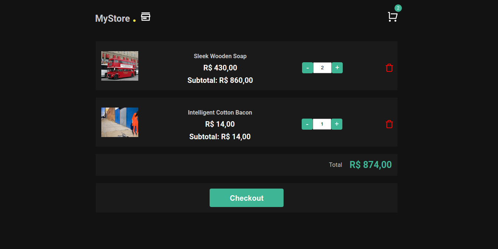

<h1 align="center">MyStore</h1>
<p>
Uma loja simples em React utilizando Typescript, com um catálogo de produtos e um carrinho de compras. Você pode adicionar/remover produtos do catálogo no carrinho de compras
</p>

 
 


## Technologies used
  - [ReactJS](https://pt-br.reactjs.org/)
  - [Typescript](https://www.typescriptlang.org)
  - [Styled Components](https://www.styled-components.com)

## Config used
  - [Eslint](https://eslint.org)
  - [Husky](https://typicode.github.io/husky/#/)
  - [Lint Staged](https://github.com/okonet/lint-staged)
  - [Jest](https://jestjs.io)
  - [Testing Library React](https://testing-library.com/docs/react-testing-library/intro/)
  - [Editor Config](https://editorconfig.org/)

## Getting Started

First, install all dependencies:

```bash
yarn install
```

Second, run the development server:

```bash
yarn start
```

## Commands

- `start`: runs your application on `localhost:3000`
- `build`: creates the production build version
- `lint`: runs the linter in all components and pages
- `lint:fix`: runs the linter in all components and pages and fix,
- `test`: runs jest to test all components and pages
- `test:watch`: runs jest in watch mode
- `lint-staged`: run lint-staged,
- `prepare`: husky install,

Open [http://localhost:3000](http://localhost:3000) with your browser to see the result.


Open [App hosted on vercel](https://my-trips-wheat.vercel.app) with your browser to see the result.

